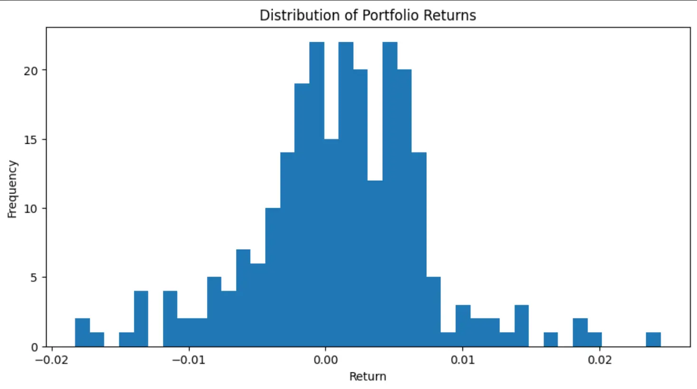
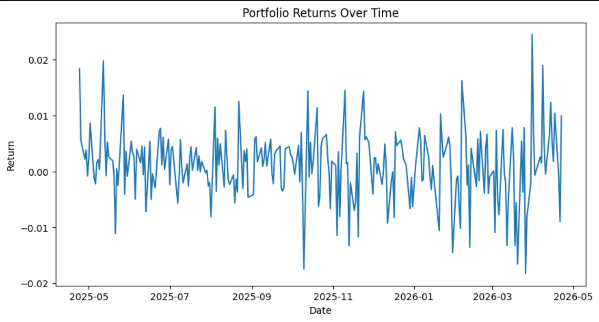

# Value at Risk (VaR) Analysis – Multi-Asset Portfolio

A multi-asset VaR model built in Excel and Python, demonstrating portfolio risk aggregation, covariance-based analysis, and reproducible data workflows.

## Overview

This project estimates portfolio risk using both **Historical VaR** and **Parametric VaR (Variance-Covariance method)** for a diversified multi-asset portfolio.

The analysis is implemented in both **Excel** and **Python** to demonstrate financial modeling and data-driven risk analysis.

---

## Portfolio

| Asset | Weight |
| ----- | ------ |
| SPY   | 40%    |
| QQQ   | 25%    |
| AGG   | 25%    |
| GLD   | 10%    |

- Portfolio Value: $100,000
- Data: Daily returns (~1 year)

---

## Methodology

### 1. Historical VaR

- Based on empirical distribution of historical returns
- 1-day VaR calculated at:
  - 90%
  - 95%
  - 99%

### 2. Parametric VaR (Variance-Covariance)

- Assumes normally distributed returns
- Uses:
  - Portfolio variance and standard deviation
  - Z-scores
  - Square-root-of-time scaling

Calculated for:

- 1-day horizon
- 10-day horizon (95%)

---

## Key Results

- Portfolio Daily Volatility: ~0.63%
- 1-Day Historical VaR (95%): ~$1,044
- 10-Day Parametric VaR (95%): ~$3,268

Interpretation:

> Under normal market conditions, the portfolio is expected to lose no more than approximately $3,268 over a 10-day period with 95% confidence.

---

## Visualizations

These visualizations provide additional context on portfolio volatility and return distribution:

### Distribution of Portfolio Returns

### Portfolio Returns Over Time

---

## Files

All files can be viewed or downloaded directly from this repository.

- `notebook/VaR_Analysis.ipynb`  
  Python notebook containing full analysis, calculations, and charts

- `excel/Portfolio_VaR.xlsx`  
  Excel-based VaR model (Historical and Parametric methods)

- `data/Price_Data.csv`  
  Input dataset (daily asset returns)

- `output/var_summary.csv`  
  Output summary generated from Python analysis

- `images/`  
  Visualizations used in this README

- `README.md`  
  Project documentation

---

## How to Run (Python)

1. Open `VaR_Analysis.ipynb` in Google Colab:
   https://colab.research.google.com/

2. Run the upload cell and upload `Price_Data.csv`

3. Run all cells from top to bottom

4. Outputs will include:
   - Covariance matrix
   - Portfolio variance and standard deviation
   - Historical VaR
   - Parametric VaR
   - Charts
   - `var_summary.csv` export

---

## Outputs

- Portfolio covariance matrix
- Portfolio variance and volatility
- Historical VaR (1-day)
- Parametric VaR (1-day and 10-day)
- Return distribution histogram
- Time series of portfolio returns

---

## Assumptions & Limitations

- Parametric VaR assumes normally distributed returns
- Historical VaR depends on the selected sample period
- Square-root-of-time scaling assumes independent returns
- Model does not fully capture extreme tail risk

---

## Tools Used

- Python (pandas, numpy, matplotlib)
- Excel (financial modeling)
- Google Colab

---

## Notes

This project demonstrates:

- Portfolio risk aggregation using covariance
- Comparison of VaR methodologies
- Practical implementation of financial risk concepts in both Excel and Python

---

## ⚠️ Disclaimer

This project is a simplified portfolio risk analysis for educational and portfolio purposes only. The data and assumptions are illustrative and do not constitute investment advice.

---

## 📬 Contact

_If you're interested in financial risk, data analysis, or finance–technology crossover roles, feel free to connect with me on [LinkedIn](https://www.linkedin.com/in/danchui/)._

_Feedback and discussion are welcome. Thank you for reviewing this project._ 🙏

---
